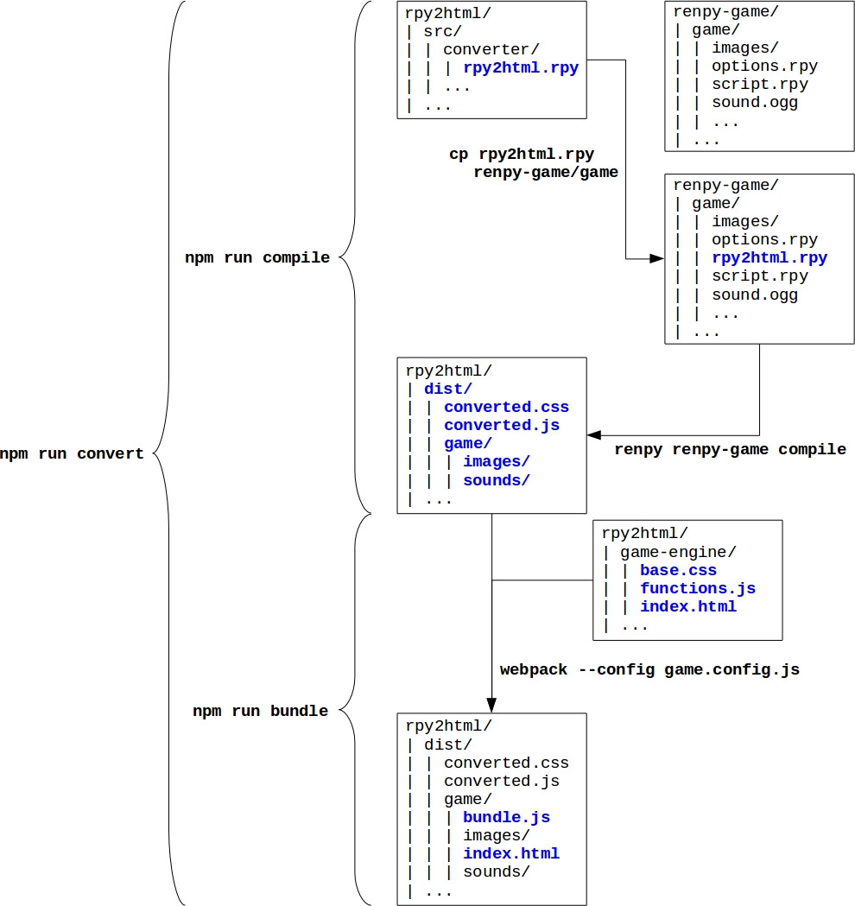

# rpy2html

Converts RenPy games to a single index.html

**Some code reused/inspired from: https://github.com/lolbot-iichan/rpy2wse**

## Requirements

* [Node.js](https://nodejs.org)

* [Python 2](https://www.python.org/downloads/) (must be avaible in PATH)

* [Ren'Py](https://www.renpy.org/latest.html) 

Install dependencies of the project: 

        npm install

## Use

        npm run convert <path-to-renpy-executable> <path-to-renpy-game>

See also:

* Only generating `dist/converted.js` and `dist/converted.css`, but don't make the bundle:

        npm run compile <path-to-renpy-executable> <path-to-renpy-game>`

* Making the bundle:
  
        npm run bundle

## What it does (without any waranty)

