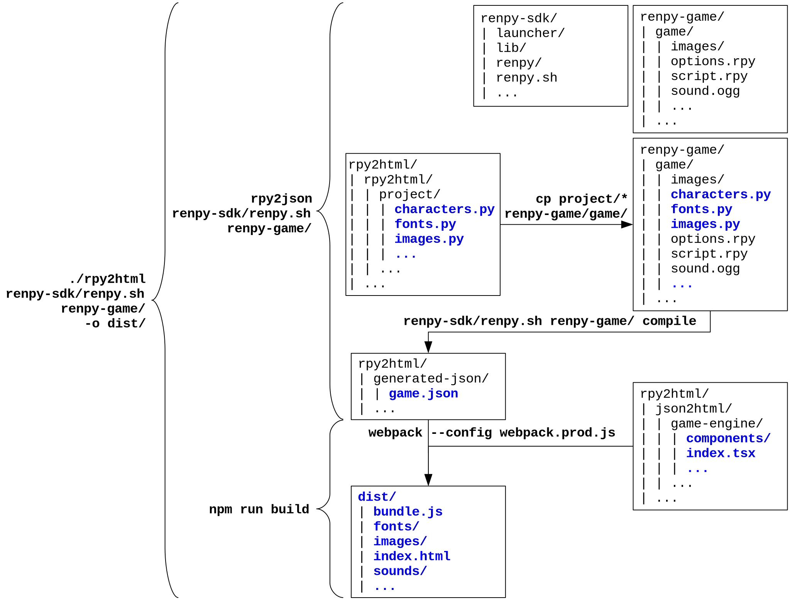

# rpy2html

Converts RenPy games to a single index.html

**Some code reused/inspired from: https://github.com/lolbot-iichan/rpy2wse**

## Requirements

* [Node.js](https://nodejs.org)

* [Python 2](https://www.python.org/downloads/) (must be avaible in PATH)

* [Ren'Py](https://www.renpy.org/latest.html) 

Install dependencies of the project (from `.`, but will be installed in `./json2html`):

    npm i --production --prefix json2html

## Use

    ./rpy2html <renpy executable> <renpy game folder> \
        [--lang <lang=en] \
        [-o <output_dir=dist>]

Default `output_dir` is `./dist`.

**See also:**

* Only generating output json, but don't make the bundle:

      rpy2json/bin/rpy2json <renpy executable> <renpy game folder> \
          [--lang <lang=en>] \
          [-o <output_file=generated-json/game.json>]

  Default `output_file` is `./generated-json/game.json`.

* Making the bundle (needs json):

      json2html/bin/json2html <json_file> \
          [-o <output_dir=dist>]

  Default `output_dir` is `./dist`.

## What it does (without any waranty)

## Game engine development

    cd json2html
    npm i

Make sure to have the `./generated-json/game.json` file.

* Start development server:

      npm run start

  Open http://localhost:3000.

* Build bundle (output directory: `rpy2html/dist`):

      npm run build

* Lint:

      npm run lint

## Note

I didn't test in on a lot of different games and there are certainly a lot of bugs. Let me know if you find some!
